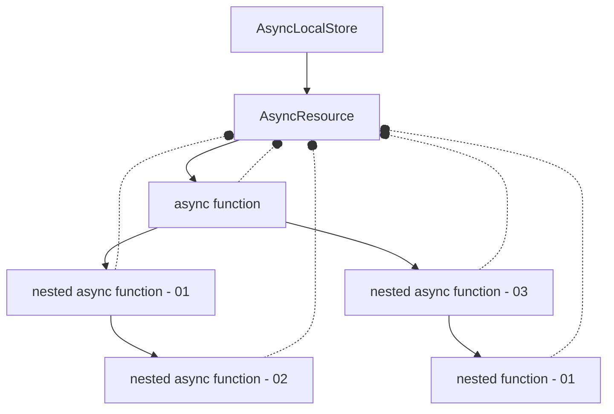

# @maeum/async-context  <!-- omit in toc -->


[](https://npmcharts.com/compare/@maeum/async-context?minimal=true)
[](https://github.com/maeumjs/async-context)
[](https://github.com/maeumjs/async-context/issues)
[](https://www.npmjs.com/package/@maeum/async-context)
[](https://github.com/maeumjs/async-context/blob/master/LICENSE)
[](https://github.com/maeumjs/async-context/actions/workflows/ci.yml)
[](https://github.com/prettier/prettier)

maeum 환경에서 async-context를 활용하기 위한 라이브러리

## Why @maeum/async-context?

[async context](https://github.com/tc39/proposal-async-context)는 Stage 2 단계에 있는 새로운 proposal입니다. Node.js 환경에서 Domain이 제거된 후 이를 대체하고, 효율적인 방법으로 context를 관리할 수 있는 방법입니다. async 함수를 실행할 때 공유할 store를 지정하고 이 후 async 함수와 async 함수에서 실행한 다른 함수에서 store에 접근할 수 있습니다.

예를들면 fastify.js에서 각 request 마다 고유 id를 부여합니다. 이 고유 id는 DB 쿼리 오류 분석, 슬로우 쿼리 분석, 로직 오류 등을 추적할 때 유용하게 사용할 수 있습니다. id를 로그에 기록하기 위해서 request 객체를 전달해야 하지만 async-context를 사용하면 request 객체를 전달하지 않아도 context, id 등을 얻을 수 있습니다. fastify-request-context 플러그인을 사용하여 request에 async-context를 추가할 수 있고, @maeum/async-context를 사용하여 추가한 async-context를 탐색할 수 있습니다.

1. fastify.js FastifyRequest 객체에 async-context 추가
1. FastifyRequest 객체를 전달하지 않더라도 async-context 탐색

## Table of Contents

- [Why @maeum/async-context?](#why-maeumasync-context)
- [Table of Contents](#table-of-contents)
- [Getting Starts](#getting-starts)
- [How it works?](#how-it-works)
- [Usage](#usage)
- [License](#license)

## Getting Starts

```bash
npm i @maeum/async-context --save
```

## How it works?



그림과 같이, AsyncLocalStore를 사용하여 async function을 실행하고, watcher를 등록하여 AsyncResource를 탐색할 수 있습니다. 이 방법을 사용하면 Request 또는 Store를 전달하지 않아도 executionAsyncId 함수를 사용하여 AsyncResource를 탐색할 수 있습니다.

## Usage

```ts
import fastify from 'fastify';
import { maeumAsyncContext, AsyncContainer } from '@maeum/async-context';
import { PrismaClient } from '@prisma/client';
import { executionAsyncId } from 'node:async_hooks';

AsyncContainer.bootstrap();

const server = fastify({ logger: true });
server.regiger(maeumAsyncContext);

const prisma = new PrismaClient({
  log: [
    {
      emit: 'event',
      level: 'query',
    },
  ],
});

// event handler에서 request id를 얻기 위해 AsyncContainer의 getStore함수를 사용하여 context에 접근할 수 있습니다
prisma.$on('query', (e) => {
  const store = AsyncContainer.getStore(executionAsyncId());
  console.log(store.id, e.query, e.params);
});
```

## License

This software is licensed under the [MIT](https://github.com/imjuni/ctix/blob/master/LICENSE).
