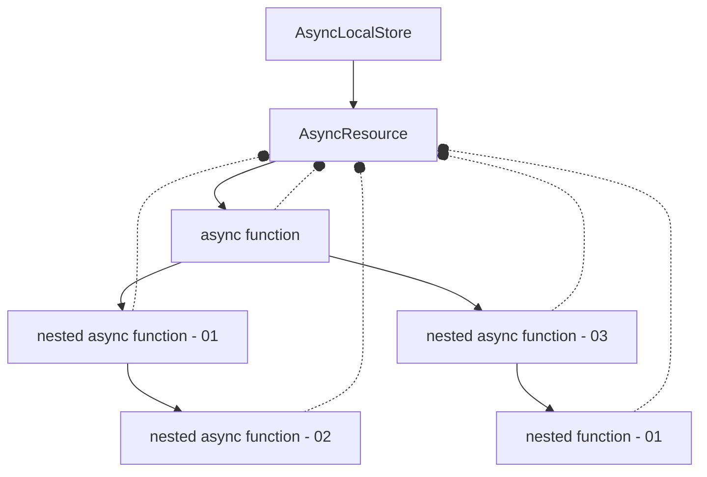

# @maeum/async-context  <!-- omit in toc -->


[](https://npmcharts.com/compare/@maeum/async-context?minimal=true)
[](https://github.com/maeumjs/async-context)
[](https://github.com/maeumjs/async-context/issues)
[](https://www.npmjs.com/package/@maeum/async-context)
[](https://github.com/maeumjs/async-context/blob/master/LICENSE)
[](https://github.com/maeumjs/async-context/actions/workflows/ci.yml)
[](https://github.com/prettier/prettier)

Packages for enhance [async context](https://github.com/tc39/proposal-async-context) mechanishm

## Why @maeum/async-context?

[async context](https://github.com/tc39/proposal-async-context) is a new proposal that is in Stage 2. It's a replacement for Domain after it was removed from the Node.js environment, and a way to manage context in an efficient way. When you run an async function, you specify a store to share, and then the store can be accessed by the async function and other functions run by the async function.

For example, in [fastify.js](https://fastify.dev/), each request is given a unique ID. This unique ID can be useful for analyzing DB query errors, analyzing slow queries, tracking logic errors, and more. In order to log the ID, you have to pass the request object, but with async-context, you can get the context, ID, etc. without passing the request object. You can use the fastify-request-context plugin to add an async-context to a request, and you can use @maeum/async-context to explore the async-context you've added.

1. adding an async-context to the fastify.js [FastifyRequest](https://fastify.dev/docs/latest/Reference/Request/) object
1. navigate to the async-context even if you don't pass a FastifyRequest object

## Table of Contents

- [Why @maeum/async-context?](#why-maeumasync-context)
- [Table of Contents](#table-of-contents)
- [Getting Starts](#getting-starts)
- [How it works?](#how-it-works)
- [Usage](#usage)
- [License](#license)

## Getting Starts

```bash
npm i @maeum/async-context --save
```

## How it works?



As shown, you can use AsyncLocalStore to execute the async function and register a watcher to navigate to the AsyncResource. This method allows you to browse the AsyncResource using the executionAsyncId function without passing a FastifyRequest or AsyncLocalStore.

## Usage

```ts
import fastify from 'fastify';
import { maeumAsyncContext, AsyncContainer } from '@maeum/async-context';
import { PrismaClient } from '@prisma/client';
import { executionAsyncId } from 'node:async_hooks';
import { fastifyRequestContext } from '@fastify/request-context';

AsyncContainer.bootstrap({ resourceTypes: ['request-id-tracker'] });

class TrackerAsyncResource {
  #tid: string;

  #lang: string | undefined;

  constructor(tid: string, lang: string | undefined, type?: string, triggerAsyncId?: number) {
    super(type ?? CE_SERVER_DEFAULT_VALUE.TRACKING_ID_AC, triggerAsyncId);

    this.#tid = tid;
    this.#lang = lang;
  }

  get tid() {
    return this.#tid;
  }

  get lang() {
    return this.#lang;
  }
}


const server = fastify({ logger: true });

server.regiger(fastifyRequestContext, {
  defaultStoreValues: (req) => ({ tid: req.id }),
  createAsyncResource: (req) => {
    const resource = new TrackerAsyncResource(
      req.id,
      req.headers['accept-language'],
      'request-id-tracker',
      executionAsyncId(),
    );
    AsyncContainer.it.setStore(executionAsyncId(), resource);
    return resource;
  },
});

server.get(async (req) => {
  console.log('id is same, ', req.id, (await AsyncContainer.getStore(executionAsyncId())).tid);
  const pet = await petSelectDao({ petId: req.query.id });
  return pet;
});

const prisma = new PrismaClient({
  log: [
    {
      emit: 'event',
      level: 'query',
    },
  ],
});

async function petSelectDao(petId: string) {
  console.log('id is same, ', req.id, (await AsyncContainer.getStore(executionAsyncId())).tid);
  return prisma.find({ id: petId });
}

// To get the request id in the event handler, you can use the AsyncContainer's getStore function to access the context
prisma.$on('query', (e) => {
  const store = AsyncContainer.getStore(executionAsyncId());
  console.log(store.id, e.query, e.params);
});
```

## License

This software is licensed under the [MIT](https://github.com/imjuni/ctix/blob/master/LICENSE).
